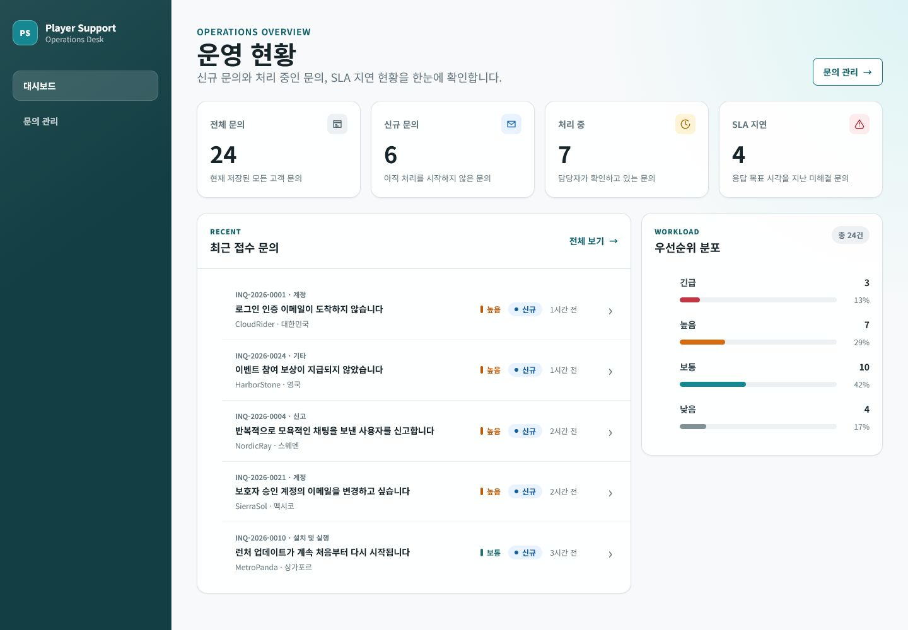
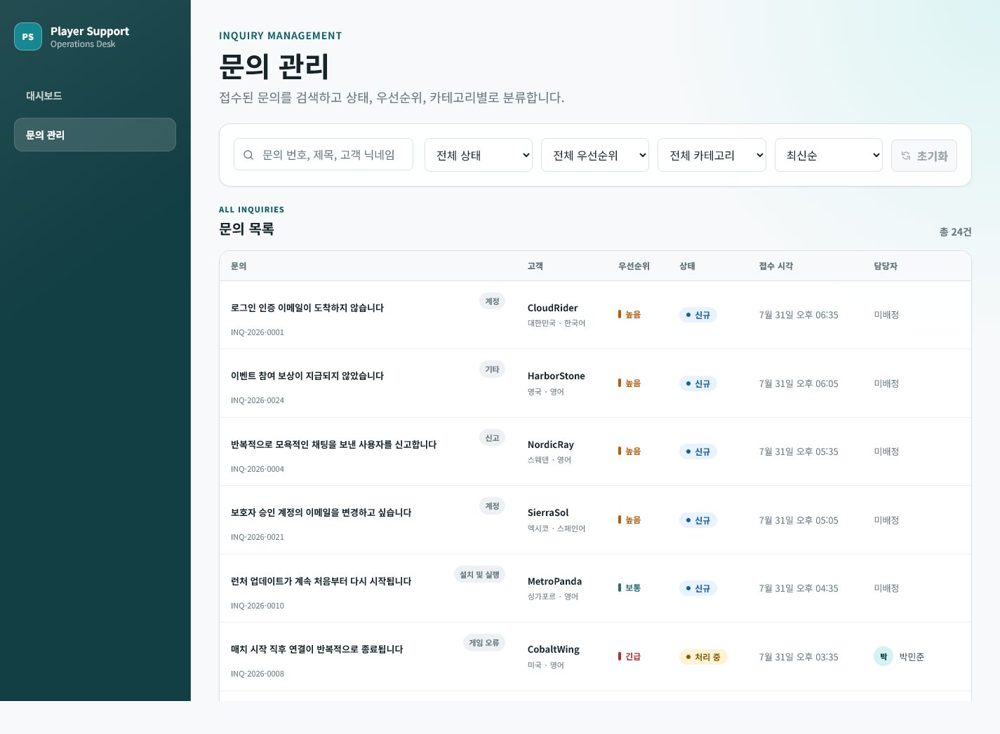
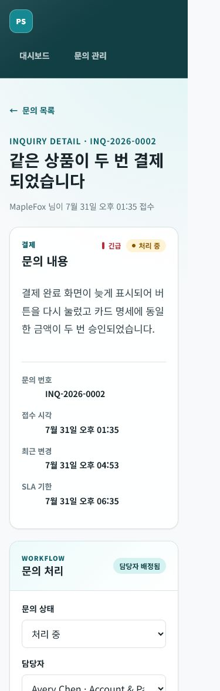

# Player Support Desk

> Vue 3와 TypeScript로 구현한 반응형 게임 고객 문의 운영 대시보드

가상의 글로벌 게임 서비스에서 운영 담당자가 문의 현황을 파악하고, 검색·분류·처리하는 흐름을 구현한 프론트엔드 포트폴리오 프로젝트입니다. React 프로젝트 경험을 Vue의 Composition API, Template, Pinia와 연결해 학습하고 실제 동작과 테스트 결과로 검증하는 데 초점을 맞췄습니다.

- 한글 이름: **플레이어 지원 데스크**
- 구현 및 검증: **2026-07-31**
- 주요 사용자: 접수된 고객 문의를 조회하고 처리하는 운영 담당자
- 데이터: 실제 회사·게임 정보가 아닌 가상의 문의 24건

## 대표 화면

### 운영 현황 대시보드

전체·신규·처리 중·SLA 지연 문의와 최근 접수 문의, 우선순위 분포를 한 화면에서 확인합니다.



### 검색과 필터가 가능한 문의 목록

문의 번호·제목·고객 검색, 상태·우선순위·카테고리 필터, 정렬과 페이지네이션을 지원합니다.



### 모바일 문의 상세와 처리

모바일에서는 문의 내용, 처리 폼, 고객 정보, 운영 메모와 처리 이력을 한 열의 작업 순서로 제공합니다.



## 핵심 사용자 흐름

1. 대시보드에서 전체, 신규, 처리 중, SLA 지연 현황을 확인합니다.
2. 문의 목록에서 검색, 필터, 정렬과 페이지 이동으로 필요한 문의를 찾습니다.
3. 상세 화면에서 문의 본문, 고객 정보와 처리 이력을 확인합니다.
4. 상태와 담당자를 변경하거나 운영 메모를 남깁니다.
5. 변경 결과가 상세 화면과 목록, 대시보드 집계에 반영됩니다.
6. 변경된 데이터와 목록 조건은 새로고침 후에도 복원됩니다.

## 주요 기능

| 화면 | 기능 | 상태 처리 |
| --- | --- | --- |
| 대시보드 | 문의 요약, 최근 문의, 우선순위 분포 | Skeleton, API 오류, 다시 시도 |
| 문의 목록 | 검색 Debounce, 다중 필터, 정렬, 페이지네이션 | URL Query 복원, 요청 경합 방지, 오류·빈 결과 |
| 문의 상세 | 상태·담당자 변경, 운영 메모, 처리 이력 | Lazy Loading, 저장 중·성공·실패, 404 |
| 공통 UI | 반응형 내비게이션, 상태·우선순위 Badge | 키보드 포커스, `aria-live`, reduced motion |

## 기술 스택

| 구분 | 기술 | 사용 이유 |
| --- | --- | --- |
| UI | Vue 3, SFC, Composition API | Template·로직·스타일의 역할을 구분하고 Vue의 반응형 모델을 학습 |
| 언어 | TypeScript | 문의 도메인과 API 요청·응답 계약을 명시하고 외부 입력을 런타임에도 검증 |
| 상태 관리 | Pinia | 목록과 상세가 공유하는 문의 데이터와 비동기 상태 관리 |
| 라우팅 | Vue Router | 화면 전환, Lazy Loading, 문서 제목과 경로 이동 포커스 관리 |
| API | Fetch API, MSW | 실제 REST 호출 구조를 유지하면서 독립적으로 조회·변경·오류 흐름 구현 |
| 영속화 | localStorage | 변경 결과를 새로고침 이후에도 유지하고 손상 데이터 복구 경로 제공 |
| 스타일 | CSS Token, Grid, Flexbox | JavaScript `resize` 없이 명확한 반응형 경계 구현 |
| 테스트 | Vitest, Vue Test Utils, jsdom, MSW | 컴포넌트 계약, Store·API와 화면 간 핵심 흐름 검증 |

## 설계와 상태의 위치

```text
View
├─ UI Component         화면 표시와 사용자 입력
├─ Pinia Store          여러 화면이 공유하는 문의 데이터와 요청 상태
└─ API Service          fetch 요청과 ApiError 변환
      └─ MSW Handler    REST 조회·변경·검증·오류 응답
            └─ localStorage
```

상태는 필요한 최소 범위에 둡니다.

- **URL Query**: 검색어, 상태, 우선순위, 카테고리, 정렬, 페이지
- **Pinia**: 문의 목록·상세 원본, 페이지네이션, 조회·변경 상태
- **컴포넌트 로컬 상태**: 검색 입력, 모바일 필터 열림 여부, 메모 초안과 성공 알림
- **MSW + localStorage**: 가상 API 데이터의 원본과 영속화

목록 조건을 URL에 두어 새로고침, 링크 공유와 브라우저 앞·뒤 이동에서도 같은 결과를 복원합니다. 새 조회가 시작되면 이전 요청을 취소하고 요청 식별자를 비교해 늦은 응답이 최신 목록을 덮지 않게 했습니다.

## Mock REST API

| Method | Endpoint | 역할 |
| --- | --- | --- |
| `GET` | `/api/dashboard` | 문의 통계와 최근 문의 조회 |
| `GET` | `/api/agents` | 담당자 목록 조회 |
| `GET` | `/api/inquiries` | 검색·필터·정렬·페이지 조회 |
| `GET` | `/api/inquiries/:id` | 문의 상세 조회 |
| `PATCH` | `/api/inquiries/:id` | 상태와 담당자 변경 |
| `POST` | `/api/inquiries/:id/notes` | 운영 메모 추가 |

애플리케이션은 MSW 구현을 직접 참조하지 않고 `services/api.ts`의 `fetch` 함수만 사용합니다. 따라서 실제 백엔드로 교체할 때 View와 Store의 호출 계약을 유지할 수 있습니다.

## 반응형과 접근성

- `1200px` 이상: 고정 사이드바, 4열 요약 카드, 문의 테이블
- `768px~1199px`: 상단 내비게이션, 2열 요약 카드
- `767px` 이하: 문의 카드 목록, 접이식 필터, 한 열의 상세 처리 순서
- `320px`, `390px`, `767/768px`, `1199/1200px`에서 가로 넘침과 경계 전환 확인
- 본문 바로가기, 시맨틱 Landmark, 폼의 접근 가능한 이름과 텍스트를 포함한 상태 표시
- 실제 경로 이동 후 첫 `h1`으로 포커스를 옮기되 최초 접속과 Query 변경에서는 현재 포커스 유지
- 밝은 화면과 어두운 내비게이션의 포커스 토큰 분리, 색상 대비 자동화 테스트
- `prefers-reduced-motion` 설정에서 애니메이션과 전환 축소

## 테스트와 검증

```bash
npm run format:check
npm run lint
npm run type-check
npm run test:unit
npm run build
npm audit --omit=dev
```

| 검증 | 결과 |
| --- | --- |
| Vitest | 9개 파일, 37개 테스트 통과 |
| TypeScript | `vue-tsc --build` 통과 |
| ESLint | 오류 없음 |
| Prettier | 전체 파일 형식 통과 |
| Production build | Vite 빌드와 상세 화면 Lazy chunk 생성 확인 |
| Runtime audit | 배포 의존성 취약점 0건 |
| Browser QA | 상태 변경 → 새로고침 → 목록·집계 반영, 반응형 경계와 가로 넘침 확인 |

자동화 테스트는 다음 범위를 나눠 검증합니다.

- 컴포넌트: 검색·필터·변경·오류·재시도 등 사용자 동작
- Store와 API: 요청 경합, 데이터 저장, 오류 계약과 집계 갱신
- 앱 통합: 상세 변경 이후 목록·대시보드 반영, 앱 재마운트 복원, URL 조건을 유지한 실패 복구
- 접근성: 공통 앱 셸의 포커스 계약과 텍스트·Badge 색상 대비

## Vue를 적용하며 확인한 차이

| 주제 | 이 프로젝트의 Vue 적용 | React 경험과 연결한 지점 |
| --- | --- | --- |
| UI 작성 | SFC Template의 `v-if`, `v-for`, 속성 바인딩 | JSX 표현식 대신 선언적인 Directive로 화면 조건 표현 |
| 지역 상태 | `ref`, 파생 값은 `computed` | `useState`, 일반 계산·`useMemo`와 책임 비교 |
| 변화 감지 | URL·라우트 ID처럼 외부 동기화가 필요한 값만 `watch` | `useEffect`와 달리 관찰 소스를 명시하고 파생 값에는 사용하지 않음 |
| 컴포넌트 계약 | Props로 입력, Emit으로 사용자 의도 전달 | 값과 Callback을 함께 전달하는 React Props와 비교 |
| 공유 상태 | Setup Store의 state와 action | 화면 트리에 공급하는 Context보다 도메인 동작의 위치가 명확함 |

Vue 숙련도를 과장하기보다 React에서 익힌 컴포넌트 분리와 단방향 데이터 흐름을 Vue 방식으로 다시 구현하고, 차이를 코드와 테스트로 설명할 수 있는 상태를 목표로 했습니다.

## 로컬 실행

### 요구 환경

- Node.js `20.19+` 또는 `22.12+`
- npm

```bash
git clone https://github.com/ndh5178/player-support-desk.git
cd player-support-desk
npm install
npm run dev
```

기본 개발 주소는 Vite가 출력하는 로컬 URL입니다. 브라우저의 `player-support-desk:inquiries:v1` 저장 값에 변경된 가상 문의가 유지됩니다.

## 프로젝트 구조

```text
src/
├─ components/   공통·대시보드·문의·레이아웃 UI
├─ views/        라우트 단위 화면과 데이터 조회 조합
├─ stores/       Pinia 문의 공유 상태와 비동기 액션
├─ services/     fetch API 클라이언트와 오류 변환
├─ mocks/        MSW 핸들러, 가상 데이터와 localStorage
├─ router/       라우트, 문서 제목과 화면 포커스
├─ types/        문의 도메인과 API 계약
└─ utils/        Query, 날짜, 표시 문구와 복제 함수

tests/
├─ accessibility/
├─ components/
├─ integration/
├─ stores/
└─ utils/
```

## 제한 사항과 다음 단계

- 인증·권한, 실제 DB와 운영 백엔드는 범위에 포함하지 않았습니다.
- 데이터는 브라우저별 `localStorage`에 저장되어 다른 사용자나 기기와 공유되지 않습니다.
- 실시간 채팅, 파일 첨부와 이미지 업로드는 구현하지 않았습니다.
- 현재 README에는 검증되지 않은 배포 URL을 제공하지 않습니다.
- 다음 단계에서는 정적 호스팅 배포와 브라우저 E2E 테스트를 추가할 수 있습니다.

## 프로젝트 문서

- [프로젝트 요구사항](docs/PROJECT_SPEC.md)
- [구현 계획](docs/IMPLEMENTATION_PLAN.md)
- [작업 단위와 완료 기준](docs/WORK_UNITS.md)
- [프로젝트 구조](docs/PROJECT_STRUCTURE.md)
- [기술 결정 기록](docs/DECISIONS.md)
- [Vue 학습 노트](docs/LEARNING_NOTES.md)
- [QA 체크리스트](docs/QA_CHECKLIST.md)
- [Git 브랜치 및 협업 전략](docs/GIT_WORKFLOW.md)
